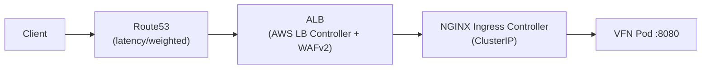
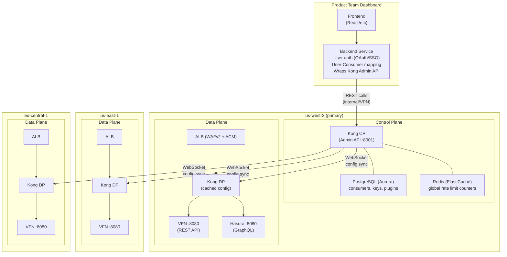
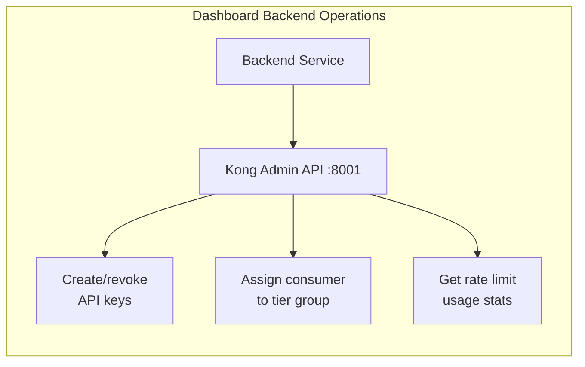
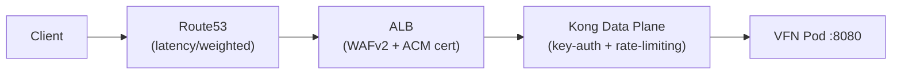
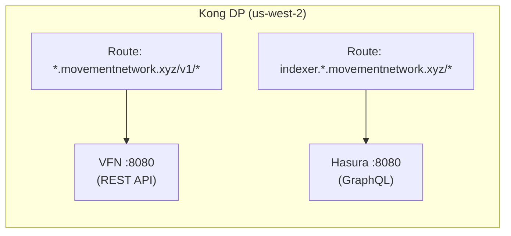
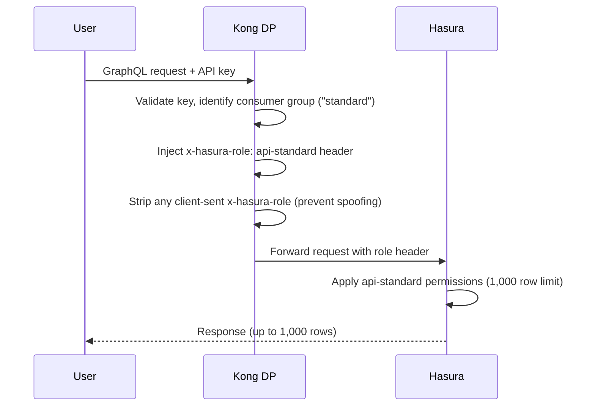

# API Token Validation & Rate Limiting for Node APIs

## Context

Movement Network's VFN REST APIs (port 8080) are publicly exposed via Route53 geo-routed DNS across multiple regions (us-west-2, us-east-1, eu-central-1, ap-northeast-1 on mainnet). Today there is no per-user authentication or token-based rate limiting — only IP-based WAFv2 rules. The product team needs users to be able to obtain API keys with tiered rate limits, and will build a web app for self-service key management.

## Decisions

- **Unauthenticated requests**: Allow with restrictive default rate limit (not blocked)
- **Scope**: Shared API endpoint only (`testnet.movementnetwork.xyz`). Per-node NLBs stay direct.
- **Solution**: Kong Gateway OSS (self-managed, in-cluster)
- **Rate limits**: Global (single counter across all regions)

## Related Documents

- [Implementation Plan](implementation.md) — phases, module specs, HCL examples, verification
- [Cost Comparison](cost-comparison.md) — self-hosted vs SaaS pricing analysis

## Current Request Path (API traffic only)



Key files:

- `infra/tofu-network-nodes/networking.tf` — NGINX controller, ALB, API networking
- `infra/tofu-network-nodes/modules/kubernetes-api-networking-alb/` — ALB + DNS for shared API
- `infra/tofu-network-nodes/modules/kubernetes-nginx-ingress-alb/` — NGINX ALB ingress
- `infra/tofu-network-nodes/main.tf` — deploy flags, config loading

## Target Architecture

### Deployment Model: Kong Hybrid Mode

Kong OSS supports a **hybrid mode** that separates the control plane (config + Admin API) from the data plane (traffic handling). This gives us fault tolerance — if the control plane goes down, data planes continue serving traffic with cached config.



The dashboard backend calls the Kong Admin API to create/revoke API keys, assign consumers to tier groups, and retrieve rate limit usage stats.



### Request Path (per region)



Kong replaces NGINX Ingress Controller in the API path. HAProxy (TCP/p2p traffic) is unaffected. Per-node NLBs are unaffected.

### Fault Tolerance

| Failure | Impact |
|---------|--------|
| Control plane down (us-west-2 CP) | Data planes continue serving with cached config. Existing keys work. Cannot create/revoke keys until CP recovers. |
| Redis down (us-west-2) | Rate limiting degrades to local counters (per-pod). Auth continues working (keys cached in DP). |
| Single region data plane down | Route53 health checks route traffic to healthy regions. No impact to other regions. |
| PostgreSQL down | Same as control plane down — DPs use cached config. Admin API returns errors. |

## Global Rate Limiting Strategy

Kong OSS `rate-limiting` plugin with `policy = "redis"` stores all counters in Redis. All data planes across regions connect to the single Redis in us-west-2 for globally accurate counters.

- ElastiCache Redis in us-west-2 (Multi-AZ for HA)
- Cross-region latency for Redis calls: ~30-70ms (acceptable — blockchain RPC responses already take 50-200ms)
- Rate limit counters are globally accurate in real-time

**Fallback if Redis is unreachable:** Kong falls back to local per-pod counters (`policy = "local"`). Rate limits become per-pod approximations until Redis recovers — prevents total auth failure.

**Future optimization if latency becomes an issue:**

- ElastiCache Global Datastore with primary in us-west-2 and read replicas per-region
- Kong reads from local replica (fast) but writes go to primary (~1s replication lag)
- Rate limits become "eventually consistent" — acceptable for rate limiting

## Indexer (GraphQL + Hasura) Integration

The network indexer (`tofu-network-indexer`) exposes a GraphQL API via Hasura at `indexer.{env}.movementnetwork.xyz`. Today it is unauthenticated for read-only queries. Kong can protect it using the same API keys and consumer tiers as the REST API.

### Architecture

Kong data planes proxy both REST API and GraphQL traffic. The indexer becomes another route on the same data plane — no separate gateway needed:



- Same API key authenticates against both services
- Product team manages one set of keys for both REST and GraphQL
- Per-route rate limits allow different thresholds for each service

### Two-Layer Rate Limiting

GraphQL queries vary wildly in cost — a single request can return 10 rows or 10,000. Rate limiting is split across two layers:

**Layer 1: Kong (request-count gating)**

Controls how many requests a user can make per time window. Example values — actual limits TBD:

| Route | Free | Standard | Premium |
|-------|------|----------|---------|
| REST API (`/v1/`) | 60 req/min | 300/min | 1000/min |
| GraphQL (`indexer.*`) | 20 req/min | 100/min | 500/min |

Lower limits on GraphQL reflect the heavier per-request cost.

**Layer 2: Hasura (query complexity gating)**

Controls how much data a single query can return. Hasura's built-in per-role permissions handle this natively — no custom code needed.

### Tier-to-Role Mapping

Kong's `request-transformer` plugin injects an `x-hasura-role` header based on the user's consumer group. Hasura reads this header and applies role-specific permissions:

| Kong Consumer Group | Hasura Role | Row Limit | Table Access |
|---------------------|-------------|-----------|--------------|
| `free` | `api-free` | 100 rows | Public tables only |
| `standard` | `api-standard` | 1,000 rows | All tables |
| `premium` | `api-premium` | 10,000 rows | All tables + aggregations |
| anonymous (no key) | `api-anonymous` | 50 rows | Public tables only |

*Row limits and table access are examples — actual values TBD based on capacity planning.*

**How it flows:**



Hasura also enforces `query_depth_limit: 15` globally (already configured) to prevent deeply nested queries regardless of tier.

### What the User Experiences

A `free` tier user running:

```graphql
query { transactions(limit: 5000) { hash, sender, timestamp } }
```

Hasura silently caps the result to 100 rows (the `api-free` role's limit). No error — just fewer results. The user sees their tier's limits in the dashboard and can upgrade for larger queries.

### Product Team Dashboard Impact

No extra work for the product team. Assigning a user to a Kong consumer group already controls:

1. **REST API rate limits** (Kong rate-limiting plugin)
2. **GraphQL request rate limits** (Kong rate-limiting plugin, per-route)
3. **GraphQL query size limits** (Hasura role permissions, via Kong header injection)

One tier assignment, all three limits update automatically.

### Configuration Required

**Kong side (infra):**

- `request-transformer` plugin per consumer group — adds `x-hasura-role` header
- Route for `indexer.{env}.movementnetwork.xyz` pointing to Hasura ClusterIP service
- Strip client-sent `x-hasura-role` on the indexer route

**Hasura side (application config):**

- Define roles (`api-free`, `api-standard`, `api-premium`, `api-anonymous`) in Hasura metadata
- Set per-role select permissions on each table with row `limit` values
- Managed via Hasura migrations or console — no infra changes
