# Movement Explorer — MVP Project Completion Report

> **Project Name**: Movement Explorer (Movement Blockchain Explorer)
> **Planned Duration**: 12 Weeks
> **Current Status**: Deployed to staging domain, preparing for official launch
> **Document Version**: v1.0
> **Date**: March 17, 2026

---

## I. Project Overview

Movement Explorer is a professional blockchain explorer built for the Movement Network ecosystem. Users can query all public on-chain data through this platform, including transaction records, account information, block data, validator status, token assets, and network performance metrics.

The project is built with a modern frontend tech stack, features responsive design, supports both desktop and mobile access, and delivers a smooth interactive experience.

---

## II. Feature Delivery Summary

### 2.1 Planned Features Delivery Status

| Feature Module                        | Phase   | Status        |
| ------------------------------------- | ------- | ------------- |
| Infrastructure Setup                  | Phase 1 | ✅ Completed  |
| Homepage (Network Stats + Latest)     | Phase 1 | ✅ Completed  |
| Block List & Detail Pages             | Phase 1 | ✅ Completed  |
| Transaction List & Detail Pages       | Phase 1 | ✅ Completed  |
| Global Search                         | Phase 1 | ✅ Completed  |
| Network Switching                     | Phase 1 | ✅ Completed  |
| Transaction Detail (Full Tabs)        | Phase 2 | ✅ Completed  |
| Account Detail Page                   | Phase 2 | ✅ Completed  |
| Analytics Dashboard                   | Phase 2 | ✅ Completed  |
| Animations & Transitions              | Phase 2 | ✅ Completed  |
| Performance Optimization              | Phase 2 | ✅ Completed  |
| Launch Preparation (Deploy + Domain)  | Phase 2 | 🔄 In Progress |

### 2.2 Over-Delivered Features

The following features were **not in the original roadmap** and were proactively added during development based on product needs:

| Extra Feature               | Description                                                 |
| --------------------------- | ----------------------------------------------------------- |
| Validator System            | Validator list, detail pages, geographic distribution map   |
| Wallet Connection           | Integrates Aptos Wallet Standard, supports on-chain actions |
| Token / Asset Detail Pages  | Standalone Coin, Fungible Asset, and NFT detail pages       |
| CSV Data Export             | Export transaction and block data as CSV files              |
| Token / NFT Transfer Pages  | Standalone transfer history query pages                     |
| Object Detail Page          | Move Object data query page                                 |

---

## III. Feature Details

### 3.1 Homepage

The homepage is the first page users see upon entering the explorer, providing a global overview of the Movement network.

**Core Metrics Display (6 items):**

- **MOVE Price** — Real-time token price with 24-hour change indicator
- **Market Cap** — Current total market capitalization
- **Total Transactions** — Cumulative network-wide transaction count
- **Total Accounts** — Total number of network accounts
- **Peak TPS** — Highest transactions per second in the past 30 days
- **Avg Gas Price** — Current average transaction fee

**Transaction Trend Chart:**

- 14-day rolling transaction volume line chart with hover-to-view daily details

**Latest Activity:**

- Latest 10 user transactions displaying hash, type, time, sender, and status

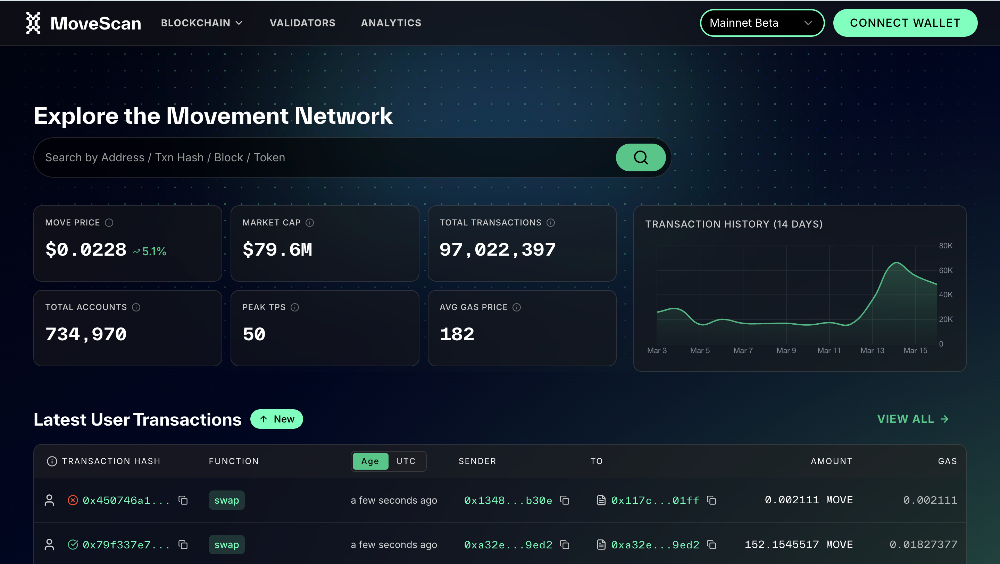

---

### 3.2 Global Search

The search bar is located at the top of the homepage and in the navigation bar, enabling quick lookup of all on-chain data types.

**Supported Search Types:**

- Account addresses (auto-detects address format)
- Transaction hashes
- Block heights (numeric input)
- Token names / symbols (e.g., MOVE, USDC, USDT)
- Fungible Asset addresses
- Move Object addresses
- Emoji Coins (Emojicoins)

**Interaction Features:**

- Search-as-you-type with 500ms debounce optimization
- Keyboard navigation: arrow keys to select results, Enter to confirm
- Shortcut key `/` to quickly open search
- Results grouped by type with type labels displayed

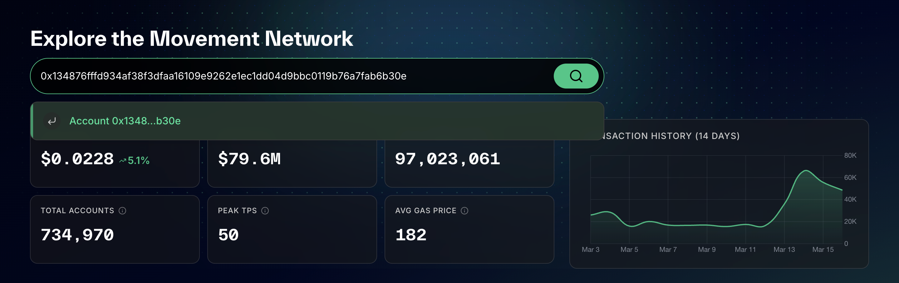

---

### 3.3 Transaction System

#### Transaction List Page

Displays all network transactions in a table with paginated browsing. Switch between "User Transactions" and "All Transactions" views.

**Features:**

- Adjustable page size (10 / 25 / 50 items)
- Checks for new transactions every 3 seconds with a top banner prompt
- CSV export support

**Account-Level Filtering (when entering from an account page):**

When navigating from an account page, additional filters are available:

- **Date Range Filter** — Preset options and custom date selection
- **Sender Address Filter** — Filter by a specified address
- **Token Type Filter** — For token transfer records (MOVE, USDC, USDT, etc.)
- **Activity Type Filter** — For NFT transfer records (Mint, Transfer, Burn, etc.)

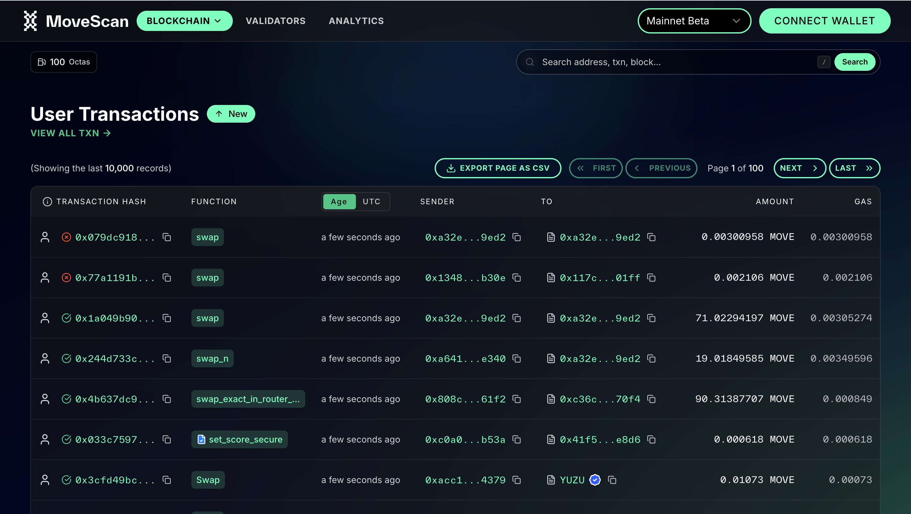

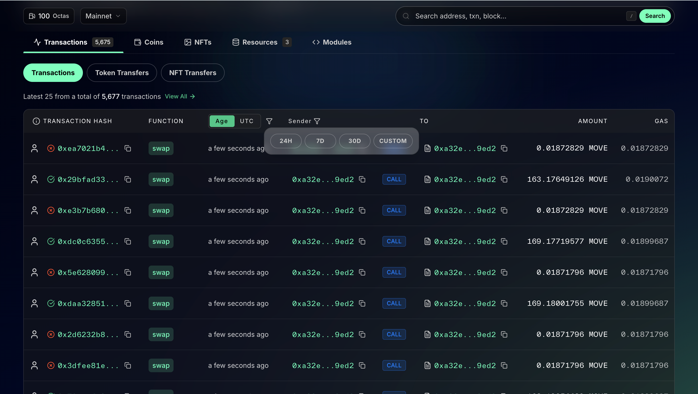

#### Transaction Detail Page

Click any transaction to view its complete information.

**Overview Information:**

- Transaction version / hash
- Status indicator (green for success, red for failure with error message)
- Timestamp (relative time + UTC absolute time)
- Gas fee (Gas used × unit price, converted to MOVE amount)
- Sender address

**Detail Tabs:**

| Tab              | Content                                                               |
| ---------------- | --------------------------------------------------------------------- |
| Balance Changes  | Visual display of token inflows/outflows; green = received, red = spent |
| Events           | All on-chain events triggered by the transaction; table and JSON views |
| Payload          | Called function, type parameters, and arguments; JSON decode view     |
| Changes          | Global storage creates / modifications / deletions; table and JSON views |
| Raw JSON         | Complete raw transaction JSON data                                    |

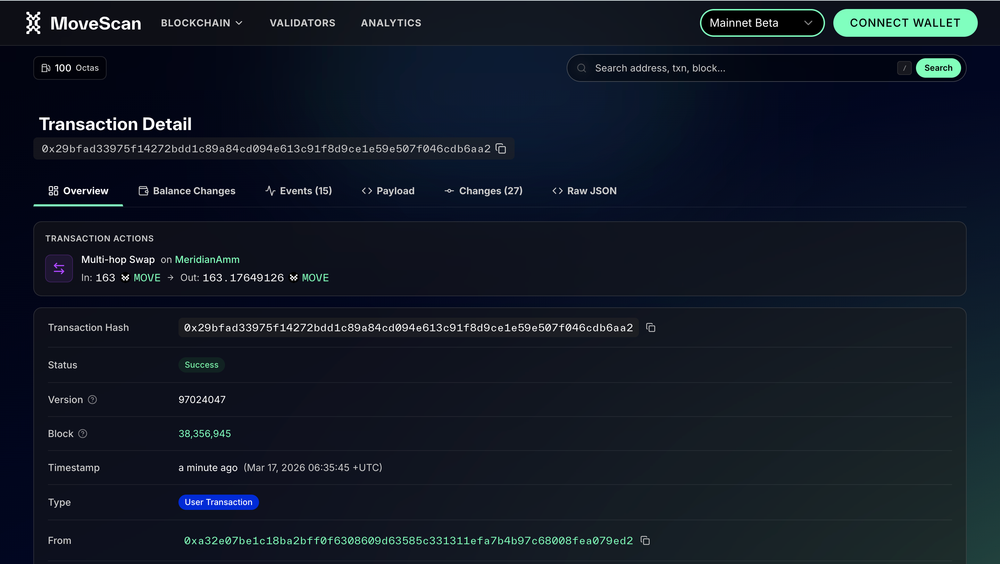

---

### 3.4 Block System

#### Block List Page

Displays the latest blocks with a new-block check every 3 seconds and a top banner prompt when new blocks arrive.

- Shows block height, hash, time, transaction count, and version range
- Supports paginated browsing and CSV export

#### Block Detail Page

Click any block to view its details:

- Block height, status, and hash
- Timestamp (relative + absolute)
- Transaction count and version range
- Block proposer validator (clickable link)
- Epoch and round numbers
- Total gas consumed
- Previous / Next block navigation buttons
- Complete transaction list within the block

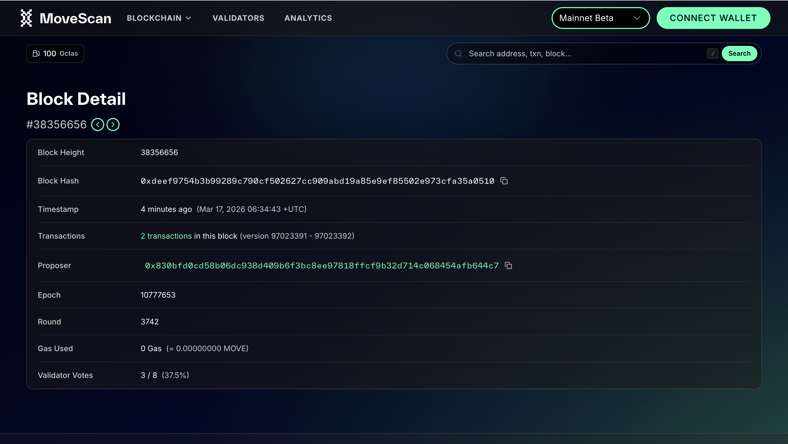

---

### 3.5 Account System

Enter or search any address to view the account's complete information.

**Account Overview:**

- Full address display with one-click copy button
- MOVE balance (raw precision + USD estimate)
- Account age (first transaction to latest transaction timeline)
- MOVE fund flow visualization (inflow / outflow statistics)
- Known address labels (e.g., official addresses, exchanges, verified projects)

**Detail Tabs (5 total):**

| Tab               | Content                                                                  |
| ----------------- | ------------------------------------------------------------------------ |
| Transactions      | Account transaction history with address / type filtering                |
| Coins             | All held tokens and balances with USD estimates, hide dust, and search   |
| NFTs              | Held NFT assets with grid / list view toggle and thumbnail previews      |
| Modules           | Deployed smart contracts with syntax-highlighted source and read/write   |
| Resources         | Mounted Move resources in a tree-expandable structure                    |

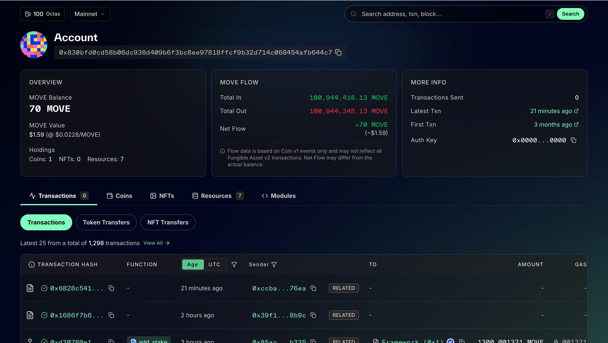

---

### 3.6 Validator System (Over-Delivered)

A dedicated validator section displaying the operational status of all Movement network validator nodes.

#### Validator List Page

**Network Statistics:**

- Total active validators
- Total voting power (staked amount)
- Staking reward APY
- Current epoch progress bar with countdown

**Validator Table:**

- Columns: Pool address, status, operator address, delegated amount, network share, commission rate, delegator count
- Sortable by voting power, network share, and commission rate
- Pagination support

**Geographic Distribution Map:**

- Interactive world map marking validator node physical locations
- Displays country and city coverage counts

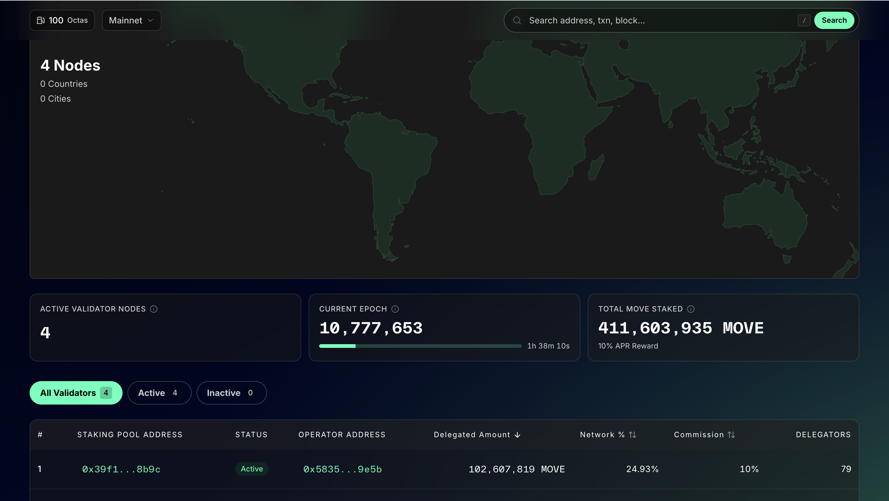

#### Validator Detail Page

- Operator address and staking pool address
- Commission rate
- Pool balance (active / pending active / locked)
- Delegator information
- Network share percentage

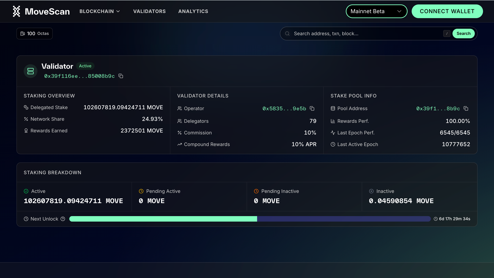

---

### 3.7 Analytics Dashboard (Over-Delivered)

A dedicated analytics page providing multi-dimensional operational metrics for the Movement network.

**9 Charts across 4 Sections:**

**Network Activity:**

1. Daily user transaction volume
2. Daily peak TPS

**User Metrics:**
3. Daily Active Users (DAU)
4. Monthly Active Users (MAU)
5. Daily new accounts

**Developer Activity:**
6. Daily contracts deployed
7. Daily contract deployers

**Gas & Fees:**
8. Daily total gas consumed
9. Daily average gas price

**Interactive Features:**

- Time range toggle (7 / 14 / 30 / 90 days)
- Sidebar quick navigation (fixed on desktop, drawer on mobile)
- Top unified metrics overview grid
- Auto-highlights the current section on scroll

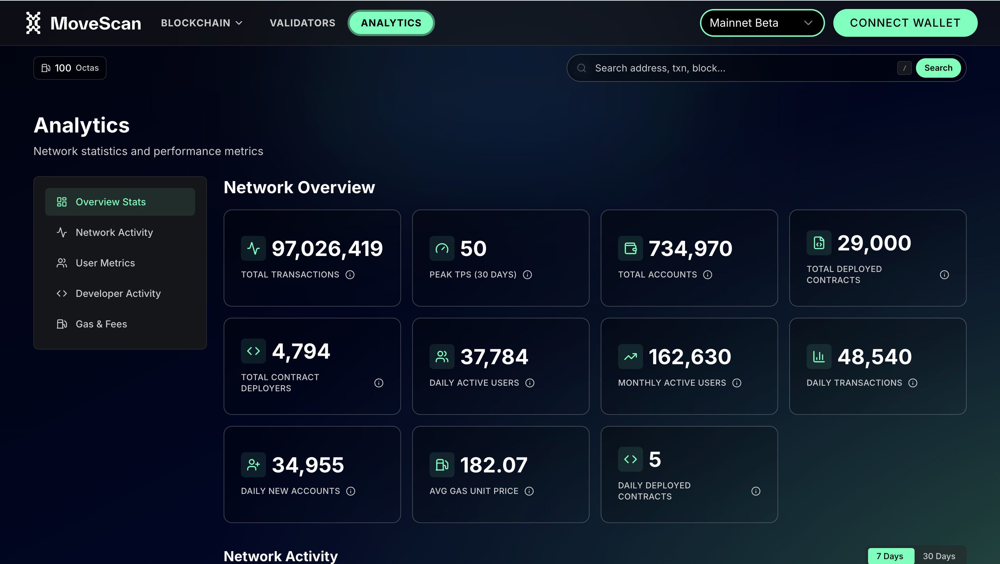

---

### 3.8 Token & Asset Pages (Over-Delivered)

#### Coin Detail Page

- Token overview: name, symbol, price, supply
- Holder list
- Transaction activity records
- Verified token badge

#### Fungible Asset Detail Page

- Asset basic information
- Holder details
- Transfer history

#### NFT / Token Detail Page

- Metadata display (name, description, attributes)
- Image / video preview (IPFS support)
- Holder information
- Activity records (transfer history)

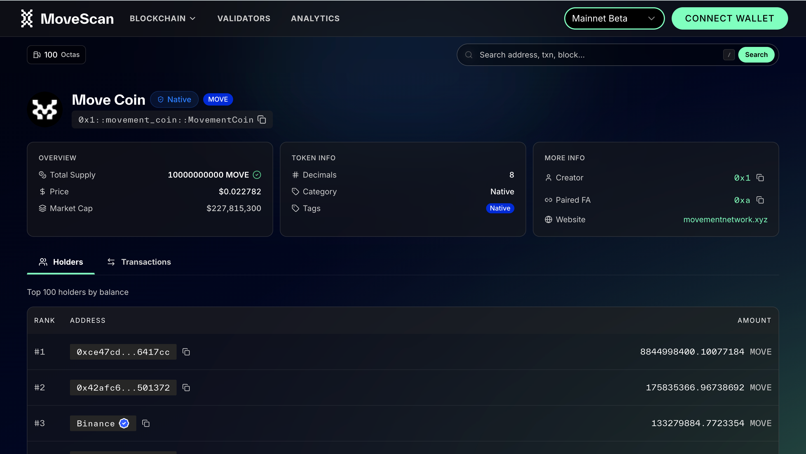

---

### 3.9 Wallet Connection (Over-Delivered)

Supports connecting personal wallets to perform on-chain operations.

**Wallet Support:**

Automatically discovers compatible wallets installed by the user via the Aptos Wallet Standard. Representative wallets include:

- Petra (Aptos Labs official wallet)
- MSafe multi-signature wallet

**Features:**

- Modal-based wallet selection and connection
- Connected wallet address displayed in the navigation bar
- Auto-reconnect support
- Direct staking operations once connected

---

### 3.10 Network Switching

Supports freely switching between different Movement networks:

| Network                     | Description                         |
| --------------------------- | ----------------------------------- |
| Mainnet                     | Default network, production environment |
| Bardock Testnet             | For development and testing purposes |

- Network selector located in the top navigation bar
- Automatically refreshes all data upon network switch
- Network state synced via URL parameters, enabling shareable network-specific links

---

### 3.11 CSV Data Export (Over-Delivered)

Both the transaction list and block list support exporting the current page data as CSV files, for offline analysis or record keeping.

---

### 3.12 Responsive Design & Theming

**Device Adaptation:**

- Desktop: Full layout with multi-column display
- Tablet: Adaptive reduced-column layout
- Mobile: Single-column stacked layout, drawer menu, touch-friendly

**Theme Support:**

- Light mode

---

## IV. Page Inventory

This project includes **15 independent pages / routes**:

| # | Page             | Route                  | Description                  |
| - | ---------------- | ---------------------- | ---------------------------- |
| 1 | Homepage         | `/`                    | Network overview & latest    |
| 2 | Transaction List | `/transactions`        | Network-wide transaction log |
| 3 | Transaction Detail | `/txn/[hash]`        | Full single transaction info |
| 4 | Block List       | `/blocks`              | Latest block list            |
| 5 | Block Detail     | `/block/[height]`      | Full single block info       |
| 6 | Account Detail   | `/account/[address]`   | Account info & assets        |
| 7 | Validator List   | `/validators`          | Validator node overview      |
| 8 | Validator Detail | `/validator/[address]` | Single validator info        |
| 9 | Analytics        | `/analytics`           | Network metrics charts       |
| 10 | Coin Detail     | `/coin/[struct]`       | Token info & activity        |
| 11 | FA Detail       | `/fa/[address]`        | Fungible Asset info          |
| 12 | Token Detail    | `/token/[tokenId]`     | NFT / Token info             |
| 13 | Object Detail   | `/object/[address]`    | Move Object info             |
| 14 | Token Transfers | `/token-transfers`     | Token transfer records       |
| 15 | NFT Transfers   | `/nft-transfers`       | NFT transfer records         |

---

## V. Technical Architecture Summary

> The following is a brief technical overview for reference.

| Dimension        | Selection                                                        |
| ---------------- | ---------------------------------------------------------------- |
| Frontend         | Next.js 16 + React 19                                            |
| Language         | TypeScript (fully typed)                                         |
| UI Components    | Movement Design System + Radix UI                                |
| Styling          | Tailwind CSS v4                                                   |
| State Management | Zustand (global state) + TanStack Query (server-side data cache) |
| Charts           | Chart.js                                                         |
| Maps             | React Simple Maps                                                |
| Animation        | Framer Motion                                                    |
| Blockchain SDK   | Aptos TS SDK (REST + GraphQL dual channel)                       |
| Package Manager  | pnpm                                                             |

**Data Fetching Architecture:**

- Three independent data clients: Aptos SDK v1 (REST), SDK v2 (blocks / balances), GraphQL Indexer (complex aggregation queries)
- 69 custom data query hooks covering all business scenarios
- Data caching strategy: 60-second cache TTL with automatic background refresh

---

## VI. Project Metrics

| Metric                  | Value                         |
| ----------------------- | ----------------------------- |
| Source Code Files       | 225+                          |
| Custom React Components | 100+                          |
| Data Query Hooks        | 69                            |
| Main Pages / Routes     | 15                            |
| Analytics Chart Types   | 9                             |
| Supported Wallets       | 6                             |
| Supported Networks      | 2 (Mainnet + Testnet)         |

---

## VII. Known Limitations & Pending Items

### 7.1 Transaction Direction Filtering Limited (Awaiting Indexer Upgrade)

**Current Situation:**

On an account's transaction history page, users typically want to filter transactions by **direction**, such as:

- **Sent** (transactions I sent to others)
- **Received** (transactions others sent to me)
- **Self-transfer** (transactions I sent to myself)
- **Contract calls** (I called a smart contract, not a transfer)
- **Associated** (I'm neither sender nor receiver, but the transaction involves me)

Currently, the Indexer data service **only provides a "sender" field and no "receiver" field**, which means:

- "Sent" can be roughly filtered (sender = my address)
- **"Received", "Self-transfer", and "Associated" cannot be filtered server-side** due to the missing receiver field
- "Sent" and "Contract calls" also cannot be precisely distinguished server-side

**Current Workaround:**

The explorer currently parses each transaction's details on the client side to determine direction, but this approach **only applies to the currently displayed page** (typically 25 records) and cannot filter across all historical transactions.

**Resolution Path:**

An indexer upgrade request has been submitted to the Movement technical team, requiring the backend to add the following fields to the data API:

| Required Field       | Purpose                                                      |
| -------------------- | ------------------------------------------------------------ |
| Receiver address     | Enable precise Sent / Received / Self-transfer / Associated filtering |
| Transaction type tag | Distinguish between "transfer" and "contract call"           |
| Amount range filter  | Support filtering by transfer amount size                    |
| Function name filter | Support filtering by specific operation called               |

> **Note:** NFT-related transfer records already have all of the above fields and can be filtered normally. This issue only affects Coin (token) transfer records. Once the indexer is upgraded, the explorer can adapt quickly with minimal code changes.

---

## VIII. Current Status & Next Steps

### Current Status

- ✅ All core feature development complete
- ✅ Deployed to staging domain and accessible
- 🔄 Preparing official domain configuration and public launch
- ⏳ Some advanced filtering features pending indexer upgrade (see Section VII)

### Future Extension Directions (For Reference)

| Direction                    | Description                                                      |
| ---------------------------- | ---------------------------------------------------------------- |
| Indexer Upgrade Adaptation   | Complete transaction direction filtering once Indexer adds fields |
| Internationalization (i18n)  | Support Chinese / English multi-language switching               |
| Enhanced Search              | Fuzzy search, dropdown auto-complete suggestions                 |
| More Analytics Metrics       | Additional dimensions of network data charts                     |

---

## IX. Summary

> **Community Feedback Note:** All user feedback and suggestions received in the community group have been addressed and improvements have been fully incorporated into the current version.

Movement Explorer MVP has delivered all planned core features on schedule, covering Phase 1 and Phase 2 modules including the homepage, transactions, blocks, accounts, search, network switching, and analytics dashboard. On top of that, additional features were delivered including the validator system, wallet connection, token asset detail pages, and CSV export.

One known limitation exists: transaction direction filtering (received/sent/self-transfer, etc.) for token transfers is constrained by missing fields in the Indexer data service, and currently only works within the current page view. This issue has been reported to the Movement backend team and will be fully supported once the data service is upgraded.

The project is currently deployed to the staging environment with core features running stably, and is ready to proceed to official launch.
